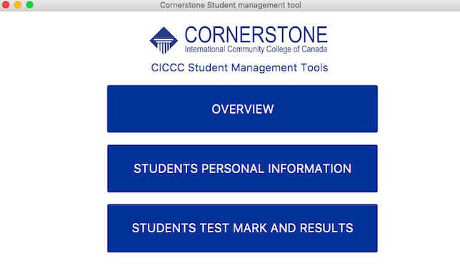
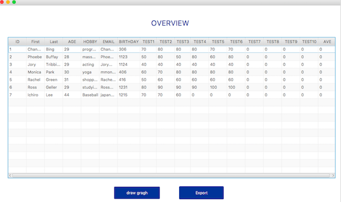
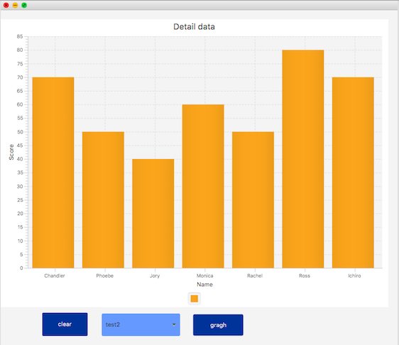
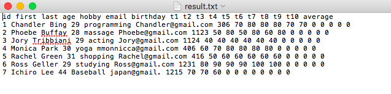
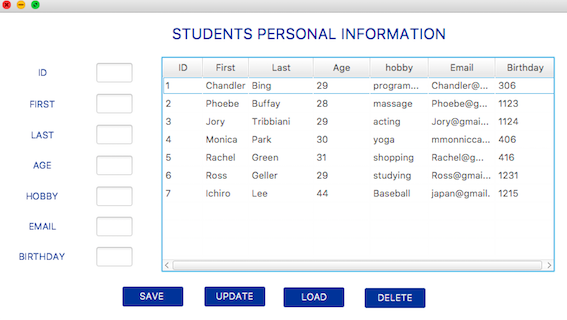
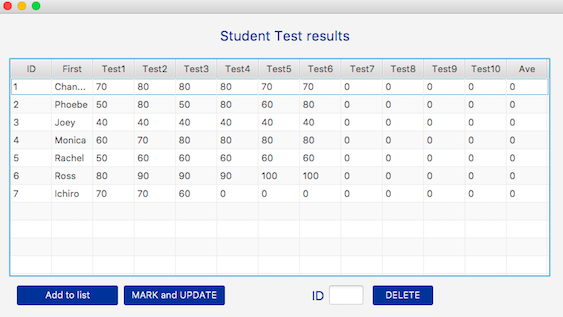

# Student management tool 

- handling student personal information and score results

- JAVAFX, MySQL

  

  ### 0. Main

### 1. Overview 

- Check all students' personal information and test results

- See the results with graphs

  

  

- Export results to text file

  

### 2. Students Personal Information

- Can modify students information

### 3. Students Test Mark And Store Results 

- Mark students' answer file(only multiple choice questions)

